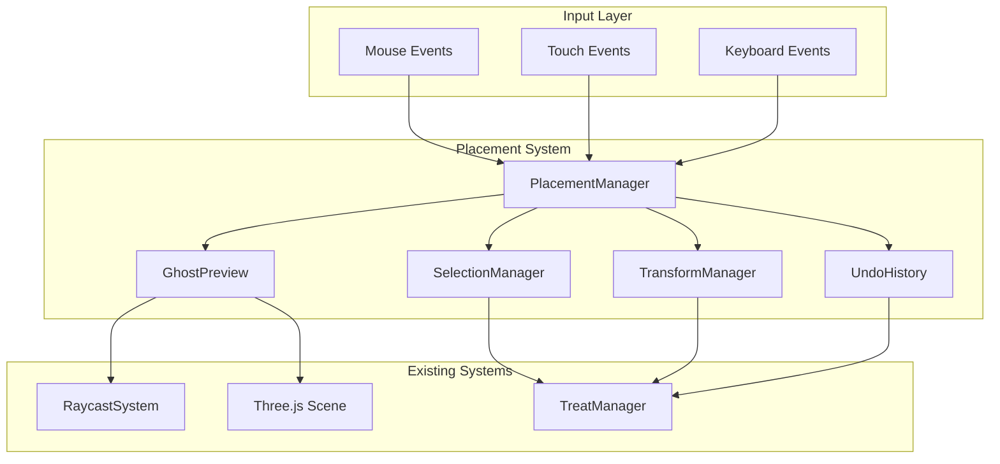

# Design Document: Placement System Enhancement

## Overview

The Placement System Enhancement transforms the treat placement experience from a "click and hope" interaction to an intuitive, preview-based workflow. Users see exactly where their treat will land before committing, can adjust placed treats by dragging, and have full control over rotation and scale.

Key improvements:
- **Ghost Preview**: Semi-transparent preview follows cursor in real-time
- **Click-to-Confirm**: Preview first, click to place
- **Post-Placement Editing**: Select and drag placed treats to reposition
- **Transform Controls**: Rotation (Q/E, scroll) and scale (Shift+scroll, +/-)
- **Undo/Redo**: Full history support for all placement actions
- **Mobile Gestures**: Touch-optimized controls with on-screen buttons

## Architecture

The placement system integrates with the existing viewer.html vanilla JS architecture, adding new components for preview rendering, selection management, and undo history.



## Components and Interfaces

### 1. PlacementManager

Central coordinator for the placement workflow. Manages state transitions between preview, placement, and adjustment modes.

```javascript
/**
 * PlacementManager - Coordinates the placement workflow
 * 
 * States:
 * - idle: No treat selected, normal navigation
 * - previewing: Ghost preview following cursor, waiting for click to place
 * - adjusting: A placed treat is selected for repositioning/transform
 */
function createPlacementManager(scene, raycastSystem, treatManager) {
  return {
    // State
    getState(): 'idle' | 'previewing' | 'adjusting',
    
    // Preview mode
    startPreview(glbUrl: string, type: string): Promise<void>,
    updatePreview(screenX: number, screenY: number): void,
    confirmPlacement(): Treat | null,
    cancelPreview(): void,
    
    // Adjustment mode
    selectTreat(treatId: string): void,
    deselectTreat(): void,
    getSelectedTreat(): Treat | null,
    
    // Transform operations (work on preview or selected treat)
    rotate(deltaRadians: number): void,
    scale(deltaScale: number): void,
    
    // Drag operations
    startDrag(screenX: number, screenY: number): void,
    updateDrag(screenX: number, screenY: number): void,
    endDrag(): void,
    
    // Events
    on(event: string, callback: Function): () => void,
  };
}
```

### 2. GhostPreview

Renders a semi-transparent preview of the treat that follows the cursor.

```javascript
/**
 * GhostPreview - Semi-transparent preview mesh
 * 
 * Features:
 * - 50% opacity for distinction from placed treats
 * - Real-time position updates from raycast hits
 * - Surface normal alignment
 * - Invalid state visualization (red tint when no valid surface)
 */
function createGhostPreview(scene) {
  return {
    // Load a GLB as the ghost preview
    load(glbUrl: string): Promise<void>,
    
    // Update position from raycast hit
    setPosition(hit: RaycastHit): void,
    
    // Show/hide based on validity
    setValid(isValid: boolean): void,
    show(): void,
    hide(): void,
    isVisible(): boolean,
    
    // Transform
    setRotationY(radians: number): void,
    getRotationY(): number,
    setScale(scale: number): void,
    getScale(): number,
    
    // Get current transform for placement
    getTransform(): { position, rotation, scale },
    
    // Cleanup
    dispose(): void,
  };
}
```

### 3. SelectionManager

Manages selection state and visual feedback for placed treats.

```javascript
/**
 * SelectionManager - Handles treat selection and visual feedback
 * 
 * Features:
 * - Selection outline/glow effect
 * - Hover highlighting
 * - Click-to-select in edit mode
 */
function createSelectionManager(scene, treatManager) {
  return {
    // Selection
    select(treatId: string): void,
    deselect(): void,
    getSelected(): string | null,
    isSelected(treatId: string): boolean,
    
    // Hover (for visual feedback)
    setHovered(treatId: string | null): void,
    getHovered(): string | null,
    
    // Visual effects
    updateSelectionVisual(): void,
    updateHoverVisual(): void,
    
    // Events
    on(event: 'select' | 'deselect' | 'hover', callback: Function): () => void,
  };
}
```

### 4. TransformManager

Handles rotation and scale operations with proper constraints.

```javascript
/**
 * TransformManager - Rotation and scale operations
 * 
 * Features:
 * - Y-axis rotation while preserving surface alignment
 * - Uniform scaling with min/max bounds (0.1x to 5x)
 * - 15-degree rotation increments
 * - 10% scale increments
 */
function createTransformManager() {
  const ROTATION_INCREMENT = Math.PI / 12; // 15 degrees
  const SCALE_INCREMENT = 0.1; // 10%
  const MIN_SCALE = 0.1;
  const MAX_SCALE = 5.0;
  
  return {
    // Rotation (preserves surface alignment)
    rotateY(mesh: THREE.Object3D, deltaRadians: number): void,
    
    // Scale (uniform, clamped)
    scale(mesh: THREE.Object3D, deltaScale: number): void,
    
    // Get increments for UI
    getRotationIncrement(): number,
    getScaleIncrement(): number,
    getScaleBounds(): { min: number, max: number },
  };
}
```

### 5. UndoHistory

Maintains action history for undo/redo support.

```javascript
/**
 * UndoHistory - Action history for undo/redo
 * 
 * Features:
 * - 20 action history limit
 * - Supports: place, move, rotate, scale, delete
 * - State snapshots for restoration
 */
interface PlacementAction {
  type: 'place' | 'move' | 'rotate' | 'scale' | 'delete';
  treatId: string;
  before: TreatState | null; // null for 'place'
  after: TreatState | null;  // null for 'delete'
}

interface TreatState {
  position: { x, y, z };
  rotation: { x, y, z, order };
  scale: { x, y, z };
}

function createUndoHistory(treatManager, maxSize = 20) {
  return {
    // Record actions
    push(action: PlacementAction): void,
    
    // Undo/redo
    undo(): boolean,
    redo(): boolean,
    canUndo(): boolean,
    canRedo(): boolean,
    
    // History info
    getUndoCount(): number,
    getRedoCount(): number,
    
    // Clear history
    clear(): void,
  };
}
```

### 6. MobileControls

On-screen controls for mobile devices.

```javascript
/**
 * MobileControls - Touch-optimized UI controls
 * 
 * Features:
 * - Confirm/Cancel buttons during preview
 * - Rotate left/right buttons
 * - Scale up/down buttons
 * - Gesture handling (pinch, two-finger rotate)
 */
function createMobileControls(placementManager) {
  return {
    // Show/hide based on state
    showPreviewControls(): void,
    showAdjustmentControls(): void,
    hideAll(): void,
    
    // Gesture handling
    handlePinch(scale: number): void,
    handleTwoFingerRotate(angle: number): void,
    
    // Button callbacks (wired internally)
    // - confirmBtn -> placementManager.confirmPlacement()
    // - cancelBtn -> placementManager.cancelPreview()
    // - rotateLeftBtn -> placementManager.rotate(-increment)
    // - rotateRightBtn -> placementManager.rotate(+increment)
    // - scaleUpBtn -> placementManager.scale(+increment)
    // - scaleDownBtn -> placementManager.scale(-increment)
  };
}
```

## Data Models

### PlacementState

```typescript
interface PlacementState {
  mode: 'idle' | 'previewing' | 'adjusting';
  previewGlbUrl: string | null;
  previewType: string | null;
  selectedTreatId: string | null;
  isDragging: boolean;
  lastValidHit: RaycastHit | null;
}
```

### TreatState (for undo/redo)

```typescript
interface TreatState {
  id: string;
  position: { x: number; y: number; z: number };
  rotation: { x: number; y: number; z: number; order: string };
  scale: { x: number; y: number; z: number };
}
```

### PlacementAction (for undo history)

```typescript
interface PlacementAction {
  type: 'place' | 'move' | 'rotate' | 'scale' | 'delete';
  treatId: string;
  timestamp: number;
  before: TreatState | null;
  after: TreatState | null;
}
```

## Correctness Properties

*A property is a characteristic or behavior that should hold true across all valid executions of a system-essentially, a formal statement about what the system should do. Properties serve as the bridge between human-readable specifications and machine-verifiable correctness guarantees.*

Based on the prework analysis, the following correctness properties have been identified:

### Ghost Preview Properties

**Property 1: Ghost preview position matches raycast hit**
*For any* cursor position over a valid surface, the ghost preview position SHALL equal the raycast hit position.
**Validates: Requirements 1.2, 1.5**

**Property 2: Ghost preview visibility follows raycast validity**
*For any* cursor position, the ghost preview SHALL be visible if and only if the raycast returns a valid hit.
**Validates: Requirements 1.3**

**Property 3: Ghost preview opacity is 50%**
*For any* visible ghost preview, all materials SHALL have opacity set to 0.5.
**Validates: Requirements 1.4**

### Placement Properties

**Property 4: Placed treat position equals ghost position**
*For any* placement confirmation, the placed treat's position SHALL equal the ghost preview's position at confirmation time.
**Validates: Requirements 2.1**

**Property 5: Placed treat has full opacity**
*For any* placed treat, all materials SHALL have opacity set to 1.0 (not ghost opacity).
**Validates: Requirements 2.2**

**Property 6: Placement exits to adjustment mode**
*For any* placement confirmation, the system SHALL exit placement mode and select the newly placed treat for adjustment.
**Validates: Requirements 2.3**

### Selection and Drag Properties

**Property 7: Drag updates treat position to raycast hit**
*For any* drag operation on a selected treat, the treat's position SHALL follow the cursor's raycast hit position.
**Validates: Requirements 3.3, 3.4**

**Property 8: Drag end commits position**
*For any* drag release, the treat's final position SHALL equal the last valid drag position.
**Validates: Requirements 3.5**

### Rotation Properties

**Property 9: Rotation changes by exact increment**
*For any* rotation input (wheel scroll, Q/E key), the treat's Y-axis rotation SHALL change by exactly 15 degrees (π/12 radians).
**Validates: Requirements 4.2, 4.3**

**Property 10: Rotation preserves surface alignment**
*For any* Y-axis rotation, the treat's alignment with the original surface normal SHALL remain unchanged.
**Validates: Requirements 4.5**

### Scale Properties

**Property 11: Scale changes uniformly**
*For any* scale operation, the treat's x, y, and z scale values SHALL change by the same factor.
**Validates: Requirements 5.1**

**Property 12: Scale is clamped to bounds**
*For any* scale operation, the resulting scale SHALL be clamped to the range [0.1, 5.0].
**Validates: Requirements 5.5**

### Undo/Redo Properties

**Property 13: Undo restores previous state**
*For any* undo operation, the affected treat's state (position, rotation, scale) SHALL equal its state before the undone action.
**Validates: Requirements 7.1**

**Property 14: Redo restores undone state**
*For any* redo operation, the affected treat's state SHALL equal its state after the original action.
**Validates: Requirements 7.2**

**Property 15: Undo history respects size limit**
*For any* sequence of more than 20 actions, only the most recent 20 actions SHALL be undoable.
**Validates: Requirements 7.3**

**Property 16: All action types are undoable**
*For any* action type (place, move, rotate, scale, delete), performing undo SHALL restore the previous state.
**Validates: Requirements 7.5**

### Mobile Properties

**Property 17: Mobile tap moves ghost to hit position**
*For any* tap on a valid surface on mobile, the ghost preview position SHALL equal the tap's raycast hit position.
**Validates: Requirements 8.2**

**Property 18: Mobile pinch scales treat**
*For any* pinch gesture on a selected treat, the treat's scale SHALL change proportionally to the pinch factor.
**Validates: Requirements 8.5**

## Error Handling

| Error | Handling |
|-------|----------|
| GLB load failure for preview | Show error status, clear preview state |
| Raycast returns no hit | Hide ghost preview, show invalid indicator |
| Undo with empty history | No-op, canUndo() returns false |
| Redo with empty redo stack | No-op, canRedo() returns false |
| Scale beyond bounds | Clamp to [0.1, 5.0], no error |
| Touch gesture conflict | Prioritize: pinch > rotate > drag |

## Testing Strategy

### Property-Based Testing

The project will use **fast-check** as the property-based testing library.

Each correctness property will be implemented as a property-based test with:
- Minimum 100 iterations per property
- Custom generators for positions, rotations, scales
- Shrinking enabled for minimal failing examples

**Test annotation format:**
```typescript
// **Feature: placement-system, Property 1: Ghost preview position matches raycast hit**
```

### Unit Testing

Unit tests will cover:
- Component initialization and disposal
- State transitions (idle → previewing → adjusting)
- Edge cases (empty history, bounds clamping)
- Event emission and subscription

### Test Organization

```
packages/skeleton/src/
├── placement/
│   ├── PlacementManager.ts
│   ├── PlacementManager.test.ts
│   ├── GhostPreview.ts
│   ├── GhostPreview.test.ts
│   ├── SelectionManager.ts
│   ├── SelectionManager.test.ts
│   ├── TransformManager.ts
│   ├── TransformManager.test.ts
│   ├── UndoHistory.ts
│   ├── UndoHistory.test.ts
│   └── placement.property.test.ts  # Property-based tests
```

### Generators

```typescript
// Position generator
const positionArb = fc.record({
  x: fc.float({ min: -100, max: 100 }),
  y: fc.float({ min: -100, max: 100 }),
  z: fc.float({ min: -100, max: 100 }),
});

// Rotation generator (radians)
const rotationArb = fc.record({
  x: fc.float({ min: -Math.PI, max: Math.PI }),
  y: fc.float({ min: -Math.PI, max: Math.PI }),
  z: fc.float({ min: -Math.PI, max: Math.PI }),
});

// Scale generator (within bounds)
const scaleArb = fc.float({ min: 0.1, max: 5.0 });

// TreatState generator
const treatStateArb = fc.record({
  id: fc.uuid(),
  position: positionArb,
  rotation: rotationArb,
  scale: fc.record({ x: scaleArb, y: scaleArb, z: scaleArb }),
});

// PlacementAction generator
const actionTypeArb = fc.constantFrom('place', 'move', 'rotate', 'scale', 'delete');
```

## Visual Design

### Ghost Preview Appearance
- 50% opacity on all materials
- Slight blue tint to distinguish from placed treats
- Red tint when over invalid surface

### Selection Visual
- Orange outline (2px) around selected treat
- Subtle pulsing glow effect

### Hover Visual
- Light highlight on hover (20% brightness increase)
- Cursor changes to pointer

### Surface Indicator
- Small orange ring at raycast hit point
- Fades in/out smoothly
- Shows surface normal direction with small arrow

### Mobile Controls Layout
```
┌─────────────────────────────────┐
│  [Cancel]              [Confirm]│  <- Top bar during preview
├─────────────────────────────────┤
│                                 │
│         3D Viewport             │
│                                 │
├─────────────────────────────────┤
│  [↺]  [↻]     [−]  [+]         │  <- Bottom bar during adjustment
└─────────────────────────────────┘
```
