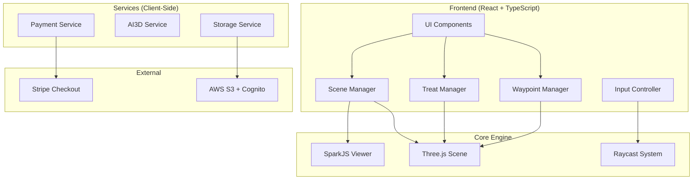
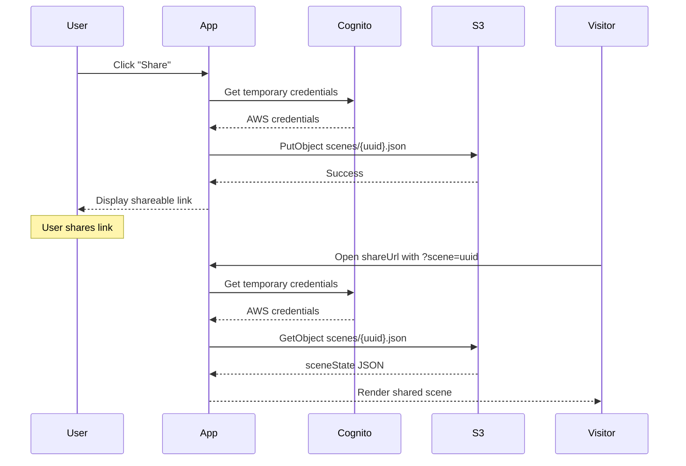

# Design Document: Splat and Treat

## Overview

Splat and Treat is a web-based 3D application built on SparkJS that enables users to explore Gaussian splat worlds and place interactive 3D treats within them. The system follows a modular skeleton architecture designed for reuse across multiple applications, demonstrating the "Skeleton Crew" hackathon category.

The application combines:

- **SparkJS** for Gaussian splat (.spz) rendering with collider support
- **Three.js** for GLB model loading and scene management
- **Stripe** for token-based payments
- **AI 3D generation** for custom treat creation
- **JSON persistence** for scene state storage

## Architecture

This is a **fully client-side application** with direct S3 access via AWS Cognito. No backend server required.



## Key Implementation References

### SparkJS Resources

- **Main repo**: https://github.com/sparkjsdev/spark
- **Raycasting example**: https://github.com/sparkjsdev/spark/blob/main/examples/raycasting/index.html
- **Basic viewer**: https://github.com/sparkjsdev/spark/blob/main/examples/basic/index.html

### Default Assets

- **Message in a Bottle**: `https://s3.amazonaws.com/worldmatica/message_in_a_bottle.glb`
- **Waypoint Marker**: `https://s3.amazonaws.com/worldmatica/geomarker_animated.glb`

## Components and Interfaces

### 1. Scene Manager (`SceneManager`)

Orchestrates the 3D scene, managing SparkJS splat rendering and Three.js object placement.

**Implementation Notes:**

- Use SparkJS `Viewer` class - it handles canvas, renderer, camera, and controls
- SparkJS exposes the Three.js scene via `viewer.scene`
- Camera controls (orbit, pan, zoom) are built into SparkJS

```typescript
// Example SparkJS initialization (from their examples)
import { Viewer } from '@sparkjsdev/spark';

const viewer = new Viewer({
  canvas: document.getElementById('canvas'),
  // SparkJS handles Three.js setup internally
});

await viewer.load('world.spz');
// Access Three.js scene: viewer.scene
// Access camera: viewer.camera
```

```typescript
interface SceneManager {
  // Initialize the scene with a splat world
  loadWorld(spzUrl: string): Promise<void>;

  // Get the Three.js scene for object placement
  getScene(): THREE.Scene;

  // Get camera for navigation
  getCamera(): THREE.PerspectiveCamera;

  // Enable/disable camera controls
  setControlsEnabled(enabled: boolean): void;

  // Dispose resources
  dispose(): void;
}
```

### 1.1 Application Mode Manager (`ModeManager`)

Manages Edit vs Explore mode state.

```typescript
type AppMode = 'edit' | 'explore';

interface ModeManager {
  // Get current mode
  getMode(): AppMode;

  // Switch modes
  setMode(mode: AppMode): void;

  // Subscribe to mode changes
  onModeChange(callback: (mode: AppMode) => void): void;
}
```

### 1.2 FPS Navigation Controller (`NavigationController`)

Handles FPS-style navigation for both desktop and mobile.

**Implementation Notes:**

- Desktop: WASD/arrows for movement, mouse drag for look
- Mobile: Virtual joystick (nipplejs library) + touch drag for look
- Use Three.js PointerLockControls as reference, but custom implementation for mobile support

```typescript
interface NavigationController {
  // Enable/disable navigation
  setEnabled(enabled: boolean): void;

  // Update camera position (call in animation loop)
  update(deltaTime: number): void;

  // Check if on mobile device
  isMobile(): boolean;

  // Get movement velocity
  getVelocity(): THREE.Vector3;
}
```

**Mobile Virtual Joystick:**

```typescript
// Using nipplejs for mobile joystick
import nipplejs from 'nipplejs';

const joystick = nipplejs.create({
  zone: document.getElementById('joystick-zone'),
  mode: 'static',
  position: { left: '60px', bottom: '60px' },
  color: 'white',
});

joystick.on('move', (evt, data) => {
  // data.vector.x, data.vector.y for movement direction
});
```

### 2. Raycast System (`RaycastSystem`)

Handles raycasting against splat colliders for treat placement.

**Implementation Notes:**

- SparkJS has built-in raycasting - see https://github.com/sparkjsdev/spark/blob/main/examples/raycasting/index.html
- Use `viewer.raycast(x, y)` to get hit point from screen coordinates
- Returns hit position and normal for surface alignment

```typescript
// Example from SparkJS raycasting example
canvas.addEventListener('click', (event) => {
  const rect = canvas.getBoundingClientRect();
  const x = ((event.clientX - rect.left) / rect.width) * 2 - 1;
  const y = -((event.clientY - rect.top) / rect.height) * 2 + 1;

  const hit = viewer.raycast(x, y);
  if (hit) {
    // hit.point - THREE.Vector3 position
    // hit.normal - THREE.Vector3 surface normal
  }
});
```

```typescript
interface RaycastHit {
  position: THREE.Vector3;
  normal: THREE.Vector3;
  distance: number;
}

interface RaycastSystem {
  // Perform raycast from screen coordinates (normalized -1 to 1)
  raycastFromScreen(x: number, y: number): RaycastHit | null;

  // Perform raycast from world ray
  raycastFromRay(origin: THREE.Vector3, direction: THREE.Vector3): RaycastHit | null;
}
```

### 3. Treat Manager (`TreatManager`)

Manages treat loading, placement, and interaction.

```typescript
interface Treat {
  id: string;
  type: TreatType;
  glbUrl: string;
  position: THREE.Vector3;
  rotation: THREE.Euler;
  scale: THREE.Vector3;
  metadata: TreatMetadata;
}

interface TreatMetadata {
  text?: string; // Attached message (max 280 chars)
  behaviorCode?: string; // Vibe code (advanced feature)
  objectId?: string; // For inter-object communication
}

type TreatType = 'custom' | 'library' | 'waypoint' | 'ai-generated' | 'message-bottle';

interface TreatManager {
  // Load a GLB and prepare for placement
  selectTreat(glbUrl: string, type: TreatType): Promise<void>;

  // Place the selected treat at a position
  placeTreat(hit: RaycastHit, metadata?: TreatMetadata): Treat;

  // Remove a placed treat
  removeTreat(treatId: string): void;

  // Get treat by ID
  getTreat(treatId: string): Treat | null;

  // Get all placed treats
  getAllTreats(): Treat[];

  // Handle treat click interaction
  onTreatClick(treatId: string): void;
}
```

### 4. Waypoint Manager (`WaypointManager`)

Manages waypoint placement, path linking, and navigation.

```typescript
interface Waypoint {
  id: string;
  position: THREE.Vector3;
  pathId?: string;
  order?: number;
  triggerAction?: WaypointAction;
}

interface WaypointPath {
  id: string;
  name: string;
  waypointIds: string[];
}

interface WaypointAction {
  type: 'audio' | 'text' | 'activate';
  payload: string;
}

interface WaypointManager {
  // Place a waypoint marker
  placeWaypoint(position: THREE.Vector3): Waypoint;

  // Link waypoints into a path
  createPath(name: string, waypointIds: string[]): WaypointPath;

  // Start navigating a path
  navigatePath(pathId: string): Promise<void>;

  // Stop navigation
  stopNavigation(): void;

  // Get all paths
  getPaths(): WaypointPath[];
}
```

### 5. Payment Service (`PaymentService`)

Handles Stripe integration for token purchases.

```typescript
interface TokenPackage {
  id: string;
  tokens: number;
  priceUsd: number;
  stripePriceId: string;
}

interface PaymentService {
  // Get available token packages
  getPackages(): TokenPackage[];

  // Create checkout session
  createCheckoutSession(packageId: string): Promise<string>; // Returns checkout URL

  // Get current token balance
  getBalance(): number;

  // Deduct tokens (returns false if insufficient)
  deductTokens(amount: number): boolean;

  // Add tokens (after successful payment)
  addTokens(amount: number): void;

  // Refund tokens
  refundTokens(amount: number): void;
}
```

### 6. AI3D Service (`AI3DService`)

Handles AI-powered 3D model generation.

```typescript
interface AI3DService {
  // Generate a 3D model from text prompt
  generate(prompt: string): Promise<string>; // Returns GLB URL

  // Check generation status
  getStatus(jobId: string): 'pending' | 'processing' | 'complete' | 'failed';
}
```

### 7. Storage Service (`StorageService`)

Handles scene state persistence to S3 for shareable links. **Fully client-side using AWS Cognito.**

**Implementation Notes:**

- Use AWS Cognito Identity Pool for anonymous credentials (no login required)
- Client uses `@aws-sdk/client-s3` directly
- IAM role scoped to `scenes/` prefix only for security
- Scene IDs are UUIDs to prevent guessing

```typescript
// AWS SDK setup with Cognito
import { S3Client, PutObjectCommand, GetObjectCommand } from '@aws-sdk/client-s3';
import { fromCognitoIdentityPool } from '@aws-sdk/credential-providers';

const s3Client = new S3Client({
  region: 'us-east-1',
  credentials: fromCognitoIdentityPool({
    identityPoolId: 'us-east-1:xxxxxxxx-xxxx-xxxx-xxxx-xxxxxxxxxxxx',
    clientConfig: { region: 'us-east-1' },
  }),
});

// Save scene
await s3Client.send(
  new PutObjectCommand({
    Bucket: 'splat-and-treat-scenes',
    Key: `scenes/${sceneId}.json`,
    Body: JSON.stringify(sceneState),
    ContentType: 'application/json',
  })
);
```

```typescript
interface SceneState {
  worldUrl: string;
  treats: Treat[];
  waypoints: Waypoint[];
  paths: WaypointPath[];
  version: number;
  createdAt: string;
  updatedAt: string;
}

interface ShareableScene {
  sceneId: string;
  shareUrl: string; // e.g., https://splatandtreat.com/scene/abc123
  s3Key: string; // e.g., scenes/abc123.json
}

interface StorageService {
  // Save scene state to S3 and get shareable link
  saveScene(state: SceneState): Promise<ShareableScene>;

  // Load scene state from S3 by scene ID
  loadScene(sceneId: string): Promise<SceneState | null>;

  // Update existing scene
  updateScene(sceneId: string, state: SceneState): Promise<void>;

  // Delete scene
  deleteScene(sceneId: string): Promise<void>;

  // Generate share URL
  getShareUrl(sceneId: string): string;
}
```

## Data Models

### Scene State JSON Schema

```json
{
  "version": 1,
  "worldUrl": "https://example.com/world.spz",
  "treats": [
    {
      "id": "treat-uuid-1",
      "type": "custom",
      "glbUrl": "https://example.com/model.glb",
      "position": { "x": 0, "y": 1, "z": 0 },
      "rotation": { "x": 0, "y": 0, "z": 0 },
      "scale": { "x": 1, "y": 1, "z": 1 },
      "metadata": {
        "text": "Hello world!"
      }
    }
  ],
  "waypoints": [
    {
      "id": "wp-uuid-1",
      "position": { "x": 5, "y": 0, "z": 5 },
      "pathId": "path-1",
      "order": 0
    }
  ],
  "paths": [
    {
      "id": "path-1",
      "name": "Tour",
      "waypointIds": ["wp-uuid-1", "wp-uuid-2"]
    }
  ]
}
```

### Token Balance Storage

```json
{
  "userId": "user-uuid",
  "balance": 50,
  "transactions": [
    {
      "id": "txn-uuid",
      "type": "purchase",
      "amount": 50,
      "timestamp": "2025-12-03T00:00:00Z"
    }
  ]
}
```

## Correctness Properties

_A property is a characteristic or behavior that should hold true across all valid executions of a system-essentially, a formal statement about what the system should do. Properties serve as the bridge between human-readable specifications and machine-verifiable correctness guarantees._

Based on the prework analysis, the following correctness properties have been identified. Properties are grouped by functional area and redundant properties have been consolidated.

### Treat Placement Properties

**Property 1: Treat placement position accuracy**
_For any_ raycast hit with a valid position, when a treat is placed, the treat's position SHALL equal the hit position.
**Validates: Requirements 2.2**

**Property 2: Treat orientation matches surface normal**
_For any_ raycast hit with a surface normal, when a treat is placed, the treat's up vector SHALL align with the hit normal.
**Validates: Requirements 2.3**

**Property 3: Placed treats persist to scene state**
_For any_ treat that is placed, the scene state SHALL contain that treat with matching id, position, rotation, and metadata.
**Validates: Requirements 2.4, 6.1**

### Text Attachment Properties

**Property 4: Text metadata storage**
_For any_ treat with attached text, the treat's metadata.text field SHALL contain the exact attached text.
**Validates: Requirements 3.3**

**Property 5: Text length constraint**
_For any_ text input longer than 280 characters, the system SHALL either truncate to 280 characters or reject the input.
**Validates: Requirements 3.5**

### Scene Persistence Properties

**Property 6: Scene state round-trip**
_For any_ valid SceneState object, serializing to JSON and then deserializing SHALL produce an equivalent SceneState object.
**Validates: Requirements 6.3, 6.4**

**Property 7: Treat restoration completeness**
_For any_ saved scene with N treats, loading that scene SHALL restore exactly N treats with matching properties.
**Validates: Requirements 6.2**

### Search and Filter Properties

**Property 8: Library search relevance**
_For any_ search query and treat library, all returned treats SHALL have names or tags containing the query string (case-insensitive).
**Validates: Requirements 4.2**

### Waypoint Properties

**Property 9: Path ordering preservation**
_For any_ set of waypoints linked into a path, the path's waypointIds array SHALL maintain the specified order.
**Validates: Requirements 5.2**

**Property 10: Multiple paths coexistence**
_For any_ world with multiple paths, each path SHALL be independently navigable without affecting other paths.
**Validates: Requirements 5.6**

### Token Balance Properties

**Property 11: Payment success increases balance**
_For any_ successful payment of N tokens, the user's balance SHALL increase by exactly N.
**Validates: Requirements 7.3**

**Property 12: Payment failure preserves balance**
_For any_ failed payment attempt, the user's balance SHALL remain unchanged.
**Validates: Requirements 7.4**

**Property 13: AI3D deducts exactly 5 tokens**
_For any_ AI3D generation request with balance >= 5, the balance SHALL decrease by exactly 5.
**Validates: Requirements 8.2**

**Property 14: Insufficient balance blocks AI3D**
_For any_ AI3D generation request with balance < 5, the request SHALL be rejected and balance SHALL remain unchanged.
**Validates: Requirements 8.4**

**Property 15: Failed AI3D refunds tokens**
_For any_ AI3D generation that fails after token deduction, the 5 tokens SHALL be refunded to the user's balance.
**Validates: Requirements 8.5**

## Error Handling

### Loading Errors

| Error              | Handling                                                   |
| ------------------ | ---------------------------------------------------------- |
| SPZ file not found | Display error toast, show world selector with alternatives |
| SPZ file corrupt   | Display error toast, suggest re-downloading                |
| GLB file not found | Display error toast, remove from selection                 |
| GLB file invalid   | Display error toast, skip loading                          |
| Network timeout    | Retry up to 3 times, then show offline message             |

### Payment Errors

| Error                         | Handling                                   |
| ----------------------------- | ------------------------------------------ |
| Stripe session creation fails | Display error, suggest retry               |
| Payment declined              | Display decline message, no balance change |
| Webhook delivery fails        | Queue for retry, eventual consistency      |

### AI3D Errors

| Error              | Handling                                        |
| ------------------ | ----------------------------------------------- |
| Generation timeout | Refund tokens, display timeout message          |
| Invalid prompt     | Display validation error, no token deduction    |
| API unavailable    | Display service unavailable, no token deduction |
| Conversion fails   | Refund tokens, display conversion error         |

### Scene Persistence Errors

| Error        | Handling                                    |
| ------------ | ------------------------------------------- |
| Save fails   | Retry with exponential backoff, notify user |
| Load fails   | Display error, offer to start fresh         |
| Corrupt data | Attempt partial recovery, log error         |

## Testing Strategy

### Property-Based Testing

The project will use **fast-check** as the property-based testing library for TypeScript.

Each correctness property will be implemented as a property-based test with:

- Minimum 100 iterations per property
- Custom generators for domain types (Treat, Waypoint, SceneState)
- Shrinking enabled for minimal failing examples

**Test annotation format:**

```typescript
// **Feature: splat-and-treat, Property 6: Scene state round-trip**
```

### Unit Testing

Unit tests will cover:

- Component initialization and disposal
- Edge cases (empty inputs, boundary values)
- Error conditions and recovery
- Integration points between modules

### Test Organization

```
src/
├── __tests__/
│   ├── properties/           # Property-based tests
│   │   ├── treat.property.test.ts
│   │   ├── scene.property.test.ts
│   │   ├── search.property.test.ts
│   │   ├── waypoint.property.test.ts
│   │   └── tokens.property.test.ts
│   ├── unit/                 # Unit tests
│   │   ├── SceneManager.test.ts
│   │   ├── TreatManager.test.ts
│   │   ├── WaypointManager.test.ts
│   │   ├── PaymentService.test.ts
│   │   └── StorageService.test.ts
│   └── generators/           # Test data generators
│       ├── treat.generator.ts
│       ├── scene.generator.ts
│       └── waypoint.generator.ts
```

### Generators

Custom fast-check generators for domain types:

```typescript
// Treat generator
const treatArb = fc.record({
  id: fc.uuid(),
  type: fc.constantFrom('custom', 'library', 'waypoint', 'ai-generated', 'message-bottle'),
  glbUrl: fc.webUrl(),
  position: vector3Arb,
  rotation: eulerArb,
  scale: vector3Arb,
  metadata: fc.record({
    text: fc.option(fc.string({ maxLength: 280 })),
    objectId: fc.option(fc.uuid()),
  }),
});

// SceneState generator
const sceneStateArb = fc.record({
  version: fc.constant(1),
  worldUrl: fc.webUrl(),
  treats: fc.array(treatArb, { maxLength: 100 }),
  waypoints: fc.array(waypointArb, { maxLength: 50 }),
  paths: fc.array(pathArb, { maxLength: 10 }),
});
```

## Project Structure

```
splat-and-treat/
├── .kiro/
│   └── specs/
│       └── splat-and-treat/
│           ├── requirements.md
│           ├── design.md
│           └── tasks.md
├── packages/
│   └── skeleton/              # Shared skeleton code
│       ├── src/
│       │   ├── core/
│       │   │   ├── SceneManager.ts
│       │   │   ├── RaycastSystem.ts
│       │   │   └── types.ts
│       │   ├── treats/
│       │   │   ├── TreatManager.ts
│       │   │   └── TreatLoader.ts
│       │   ├── waypoints/
│       │   │   ├── WaypointManager.ts
│       │   │   └── PathNavigator.ts
│       │   ├── services/
│       │   │   ├── PaymentService.ts
│       │   │   ├── AI3DService.ts
│       │   │   └── StorageService.ts
│       │   ├── persistence/
│       │   │   ├── SceneSerializer.ts
│       │   │   └── SceneDeserializer.ts
│       │   └── index.ts
│       └── package.json
├── apps/
│   ├── splat-and-treat/       # Application A: Halloween theme
│   │   ├── src/
│   │   │   ├── App.tsx
│   │   │   ├── components/
│   │   │   │   ├── TreatPanel.tsx
│   │   │   │   ├── WaypointPanel.tsx
│   │   │   │   ├── TokenDisplay.tsx
│   │   │   │   └── ShareButton.tsx
│   │   │   ├── config.ts      # App-specific config (worlds, treats)
│   │   │   └── main.tsx
│   │   ├── public/
│   │   ├── index.html
│   │   └── package.json
│   └── app-b/                 # Application B: Second demo
│       ├── src/
│       │   ├── App.tsx
│       │   ├── components/
│       │   └── config.ts      # Different config for different use case
│       └── package.json
├── package.json               # Monorepo root (pnpm workspace)
├── pnpm-workspace.yaml
├── .env.example               # Required environment variables
└── README.md
```

## Technology Stack

| Layer            | Technology                           |
| ---------------- | ------------------------------------ |
| Framework        | React 18 + TypeScript                |
| 3D Rendering     | SparkJS + Three.js                   |
| State Management | Zustand                              |
| Styling          | Tailwind CSS                         |
| Payments         | Stripe Checkout (client-side)        |
| Storage          | AWS S3 + Cognito (client-side)       |
| Testing          | Vitest + fast-check                  |
| Build            | Vite                                 |
| Monorepo         | pnpm workspaces                      |
| Hosting          | Static hosting (Vercel, Netlify, S3) |

**Note:** This is a fully client-side application. No backend server required.

## Sharing Flow (Client-Side)


