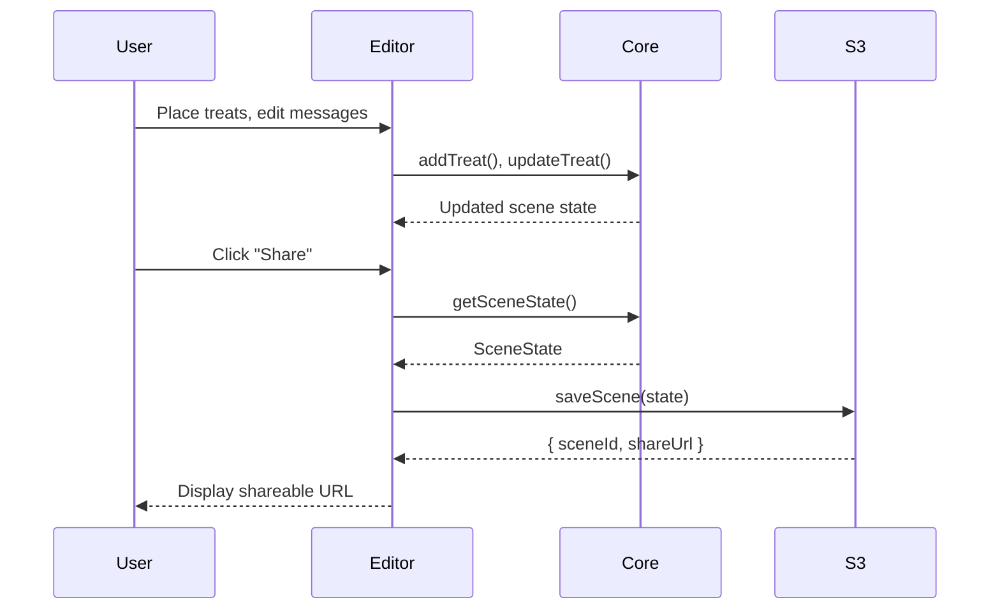
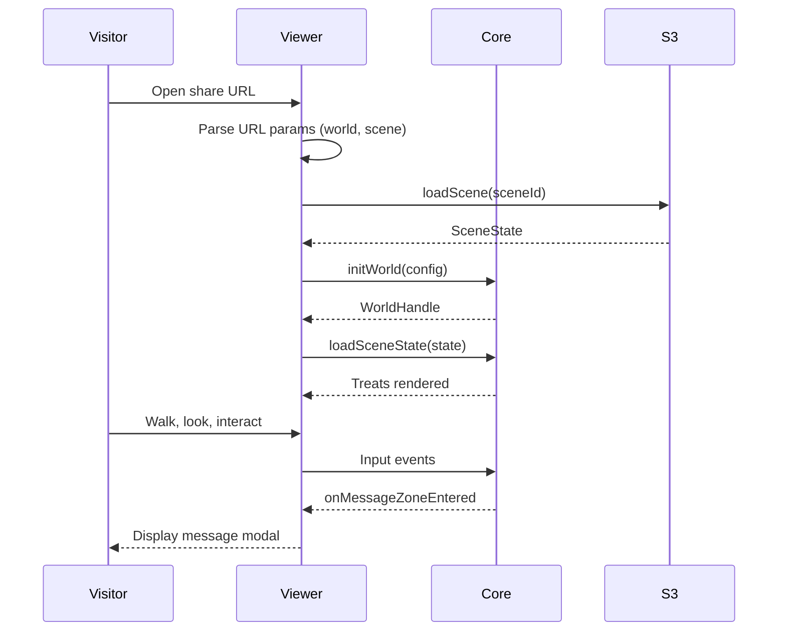

# Design Document: WorldNotes Architecture

## Overview

This design describes the refactoring of the Splat-n-Treat prototype into a generalized WorldNotes architecture with two deployable applications sharing a common core module. The architecture enables:

- **WorldNotes Core**: Shared module for splat rendering, treat management, input controls, and persistence
- **WorldNotes Editor**: Full-featured application for creating and editing 3D scenes
- **WorldNotes Viewer**: Read-only embeddable application for viewing shared scenes

Both applications are static sites deployed to S3 + CloudFront, with no backend server required. The core module handles all 3D rendering via SparkJS and Three.js, while applications provide their specific UI layers.

## Architecture

```mermaid
graph TB
    subgraph "WorldNotes Core (@worldnotes/core)"
        WNC[WorldNotesCore]
        TM[TreatManager]
        IC[InputController]
        SS[SceneSerializer]
        S3[S3StorageClient]
    end

    subgraph "Editor App (worldnotes-editor)"
        EUI[Editor UI]
        TP[TreatPanel]
        EP[EditPanel]
        SP[SharePanel]
        CP[CalibrationPanel]
    end

    subgraph "Viewer App (worldnotes-viewer)"
        VUI[Viewer UI]
        MI[MessageIndicator]
        WB[WorldBadge]
    end

    subgraph "External Services"
        SPARK[SparkJS CDN]
        THREE[Three.js CDN]
        S3B[AWS S3]
        COG[AWS Cognito]
    end

    EUI --> WNC
    VUI --> WNC
    WNC --> SPARK
    WNC --> THREE
    WNC --> S3B
    WNC --> COG
    TP --> TM
    EP --> TM
    SP --> SS
    SP --> S3


## Components and Interfaces

### 1. WorldNotesCore

The central API that both Editor and Viewer applications use. Encapsulates all 3D rendering and scene management.

```typescript
interface WorldNotesConfig {
  /** Container element for the 3D canvas */
  container: HTMLElement;
  /** SPZ world URL */
  worldUrl: string;
  /** Whether to flip Y axis (default: true for most SPZ files) */
  flipY?: boolean;
  /** Initial camera pose */
  initialPose?: CameraPose;
  /** S3/Cognito configuration */
  storage?: StorageConfig;
  /** Enable editing features (default: false for viewer) */
  editMode?: boolean;
}

interface StorageConfig {
  region: string;
  identityPoolId: string;
  bucketName: string;
  appUrl: string;
}

interface CameraPose {
  position: Vector3;
  rotation: { x: number; y: number };
}

interface WorldHandle {
  // Treat management
  addTreat(treatData: TreatData): string; // Returns treat ID
  updateTreat(treatId: string, patch: Partial<TreatData>): void;
  removeTreat(treatId: string): void;
  getTreats(): Treat[];
  getTreat(treatId: string): Treat | null;

  // Camera control
  setCameraPose(pose: CameraPose): void;
  getCameraPose(): CameraPose;

  // Scene state
  getSceneState(): SceneState;
  loadSceneState(state: SceneState): void;

  // Events
  onTreatClicked(callback: (treatId: string) => void): () => void;
  onMessageZoneEntered(callback: (treatId: string) => void): () => void;
  onModeChange(callback: (mode: AppMode) => void): () => void;

  // Mode control (Editor only)
  setMode?(mode: AppMode): void;
  getMode?(): AppMode;

  // Cleanup
  dispose(): void;
}

/**
 * Initialize a WorldNotes world.
 * @param config - Configuration for the world
 * @returns WorldHandle for scene manipulation
 */
function initWorld(config: WorldNotesConfig): Promise<WorldHandle>;
```

### 2. Treat Data Model

Treats are 3D objects placed in the world with optional attached messages.

```typescript
type TreatType = 'geomarker' | 'bottle' | 'custom' | string;

interface TreatData {
  type: TreatType;
  glbUrl: string;
  message?: string;
  position: Vector3;
  rotation: Vector3; // Euler angles (x, y, z)
}

interface Treat extends TreatData {
  id: string;
  createdAt?: string;
  updatedAt?: string;
}

interface Vector3 {
  x: number;
  y: number;
  z: number;
}
```

### 3. Scene State Persistence

Scene state is serialized to JSON for storage in S3.

```typescript
interface SceneState {
  version: number; // Schema version for migrations
  worldUrl: string;
  worldFlipY?: boolean;
  treats: Treat[];
  createdAt: string;
  updatedAt: string;
}

interface ShareableScene {
  sceneId: string;
  shareUrl: string;
  s3Key: string;
}

// Serialization functions
function serializeScene(state: SceneState): string; // JSON string
function deserializeScene(json: string): SceneState;
function migrateScene(state: SceneState, targetVersion: number): SceneState;
```

### 4. Input Controller

Handles WASD movement, mouse look, and treat interactions.

```typescript
interface InputController {
  // Enable/disable input handling
  setEnabled(enabled: boolean): void;

  // Mode affects which inputs are active
  setMode(mode: AppMode): void;

  // Update loop (call in animation frame)
  update(deltaTime: number): void;

  // Event handlers
  onPlacementClick(callback: (hit: RaycastHit) => void): () => void;
  onTreatInteract(callback: (treatId: string) => void): () => void;

  // Cleanup
  dispose(): void;
}
```

### 5. Storage Client

Client-side S3 access via Cognito for scene persistence.

```typescript
interface StorageClient {
  // Save scene and get shareable URL
  saveScene(state: SceneState, existingId?: string): Promise<ShareableScene>;

  // Load scene by ID
  loadScene(sceneId: string): Promise<SceneState | null>;

  // Generate share URL without saving
  getShareUrl(sceneId: string): string;
}
```

## Data Models

### Scene State JSON Schema

```json
{
  "version": 1,
  "worldUrl": "https://example.com/world.spz",
  "worldFlipY": true,
  "treats": [
    {
      "id": "treat-uuid-1",
      "type": "bottle",
      "glbUrl": "https://s3.amazonaws.com/worldmatica/message_in_a_bottle.glb",
      "message": "Hello from WorldNotes!",
      "position": { "x": 1.5, "y": 0.2, "z": -3.0 },
      "rotation": { "x": 0, "y": 1.57, "z": 0 },
      "createdAt": "2025-12-05T10:00:00Z",
      "updatedAt": "2025-12-05T10:00:00Z"
    }
  ],
  "createdAt": "2025-12-05T10:00:00Z",
  "updatedAt": "2025-12-05T10:00:00Z"
}
```

### URL Parameters

**Editor URL:**
```
https://editor.worldnotes.app/?world=<spzUrl>&scene=<sceneId>
```

**Viewer URL:**
```
https://viewer.worldnotes.app/?world=<spzUrl>&scene=<sceneId>&name=<worldName>
```

## Correctness Properties

*A property is a characteristic or behavior that should hold true across all valid executions of a system-essentially, a formal statement about what the system should do. Properties serve as the bridge between human-readable specifications and machine-verifiable correctness guarantees.*

Based on the prework analysis, the following correctness properties have been identified:

### Property 1: Core API Completeness

*For any* valid WorldNotesConfig, calling `initWorld(config)` SHALL return a WorldHandle object containing all required methods: `addTreat`, `updateTreat`, `removeTreat`, `getTreats`, `getTreat`, `setCameraPose`, `getCameraPose`, `getSceneState`, `loadSceneState`, `onTreatClicked`, `onMessageZoneEntered`, and `dispose`.

**Validates: Requirements 1.1, 1.2, 1.6**

### Property 2: Camera Pose Round-Trip

*For any* valid CameraPose object, calling `setCameraPose(pose)` followed by `getCameraPose()` SHALL return a CameraPose equivalent to the original (within floating-point tolerance).

**Validates: Requirements 1.3**

### Property 3: Treat Serialization Round-Trip

*For any* valid Treat object with id, type, glbUrl, position, rotation, and optional message/createdAt/updatedAt fields, serializing to JSON and deserializing SHALL produce an equivalent Treat object with all fields preserved.

**Validates: Requirements 2.1, 2.2, 2.3, 2.4, 2.5**

### Property 4: Share URL Generation

*For any* valid SceneState, serializing SHALL produce valid JSON, and generating a share URL SHALL include the scene ID as a query parameter that can be parsed back to retrieve the original scene.

**Validates: Requirements 4.1, 4.3, 4.4**

### Property 5: Viewer Scene Loading

*For any* valid URL with scene parameters, parsing SHALL extract the world URL and scene ID, and loading a scene with N treats SHALL result in exactly N treats being available via `getTreats()`.

**Validates: Requirements 5.1, 5.4**

### Property 6: Input Controls by Mode

*For any* input event (WASD key, mouse movement, click, E key), the system SHALL respond according to the current mode:
- In 'explore' mode: WASD moves camera, mouse looks, E/click opens messages
- In 'edit' mode: WASD moves camera, mouse looks, click places treats (when in placement mode), drag moves treats

**Validates: Requirements 6.1, 6.2, 6.3, 6.4, 6.5**

### Property 7: Scene State Round-Trip with Versioning

*For any* valid SceneState object, serializing to JSON and deserializing SHALL produce an equivalent SceneState. Additionally, *for any* SceneState with version < current version, migration SHALL produce a valid SceneState with the current version while preserving all treat data.

**Validates: Requirements 10.1, 10.2, 10.3, 10.4**

## Error Handling

| Error | Handling |
|-------|----------|
| SPZ file not found | Display error message, offer to return to world selection |
| SPZ file corrupt | Display error message with details |
| GLB file not found | Skip treat, log warning, continue loading others |
| S3 save fails | Retry with exponential backoff, show error after 3 attempts |
| S3 load fails (not found) | Return null, let app handle missing scene |
| S3 load fails (network) | Retry once, then show error |
| Invalid scene JSON | Attempt partial recovery, log error |
| Scene version too new | Display "update required" message |
| Cognito auth fails | Retry once, then show auth error |

## Testing Strategy

### Property-Based Testing

The project will use **fast-check** as the property-based testing library for TypeScript.

Each correctness property will be implemented as a property-based test with:
- Minimum 100 iterations per property
- Custom generators for domain types (Treat, SceneState, CameraPose, Vector3)
- Shrinking enabled for minimal failing examples

**Test annotation format:**
```typescript
// **Feature: worldnotes-architecture, Property 3: Treat serialization round-trip**
```

### Unit Testing

Unit tests will cover:
- Core module initialization with various configs
- Individual method behavior (addTreat, removeTreat, etc.)
- URL parsing edge cases
- Error conditions and recovery

### Test Organization

```
core/
├── __tests__/
│   ├── properties/
│   │   ├── core-api.property.test.ts
│   │   ├── camera-pose.property.test.ts
│   │   ├── treat-serialization.property.test.ts
│   │   ├── share-url.property.test.ts
│   │   ├── scene-loading.property.test.ts
│   │   ├── input-controls.property.test.ts
│   │   └── scene-roundtrip.property.test.ts
│   ├── unit/
│   │   ├── WorldNotesCore.test.ts
│   │   ├── TreatManager.test.ts
│   │   ├── InputController.test.ts
│   │   ├── SceneSerializer.test.ts
│   │   └── StorageClient.test.ts
│   └── generators/
│       ├── treat.generator.ts
│       ├── scene.generator.ts
│       └── vector.generator.ts
```

### Generators

Custom fast-check generators for domain types:

```typescript
import * as fc from 'fast-check';

// Vector3 generator
const vector3Arb = fc.record({
  x: fc.float({ min: -1000, max: 1000, noNaN: true }),
  y: fc.float({ min: -1000, max: 1000, noNaN: true }),
  z: fc.float({ min: -1000, max: 1000, noNaN: true }),
});

// Treat generator
const treatArb = fc.record({
  id: fc.uuid(),
  type: fc.oneof(fc.constant('geomarker'), fc.constant('bottle'), fc.constant('custom')),
  glbUrl: fc.webUrl(),
  message: fc.option(fc.string({ maxLength: 280 })),
  position: vector3Arb,
  rotation: vector3Arb,
  createdAt: fc.option(fc.date().map(d => d.toISOString())),
  updatedAt: fc.option(fc.date().map(d => d.toISOString())),
});

// SceneState generator
const sceneStateArb = fc.record({
  version: fc.constant(1),
  worldUrl: fc.webUrl(),
  worldFlipY: fc.option(fc.boolean()),
  treats: fc.array(treatArb, { maxLength: 50 }),
  createdAt: fc.date().map(d => d.toISOString()),
  updatedAt: fc.date().map(d => d.toISOString()),
});
```

## Project Structure

```
worldnotes/
├── core/                          # @worldnotes/core - Shared module
│   ├── src/
│   │   ├── WorldNotesCore.ts      # Main entry point
│   │   ├── TreatManager.ts        # Treat CRUD operations
│   │   ├── InputController.ts     # WASD, mouse, touch handling
│   │   ├── SceneSerializer.ts     # JSON serialization
│   │   ├── StorageClient.ts       # S3 + Cognito client
│   │   ├── types.ts               # TypeScript interfaces
│   │   └── index.ts               # Public exports
│   ├── __tests__/
│   └── package.json
│
├── editor/                        # worldnotes-editor app
│   ├── src/
│   │   ├── main.ts                # Entry point
│   │   ├── EditorApp.ts           # Main editor logic
│   │   ├── panels/
│   │   │   ├── TreatPanel.ts      # Treat selection/placement
│   │   │   ├── EditPanel.ts       # Treat editing modal
│   │   │   ├── SharePanel.ts      # Share modal
│   │   │   └── CalibrationPanel.ts # Camera calibration
│   │   └── styles/
│   │       └── editor.css
│   ├── public/
│   │   └── index.html
│   ├── vite.config.ts
│   └── package.json
│
├── viewer/                        # worldnotes-viewer app
│   ├── src/
│   │   ├── main.ts                # Entry point
│   │   ├── ViewerApp.ts           # Main viewer logic
│   │   ├── components/
│   │   │   ├── MessageModal.ts    # Message display
│   │   │   ├── ProximityIndicator.ts
│   │   │   └── WorldBadge.ts
│   │   └── styles/
│   │       └── viewer.css
│   ├── public/
│   │   └── index.html
│   ├── vite.config.ts
│   └── package.json
│
├── ARCHITECTURE.md                # Architecture documentation
├── README.md                      # Project overview
└── package.json                   # Workspace root
```

## Technology Stack

| Layer | Technology |
|-------|------------|
| 3D Rendering | SparkJS + Three.js (CDN importmap) |
| Language | TypeScript (strict mode) |
| Build | Vite (static HTML + vanilla JS for 3D) |
| Testing | Vitest + fast-check |
| Storage | AWS S3 + Cognito (client-side) |
| Hosting | S3 + CloudFront (static sites) |

## Data Flow

### Editor: Create and Share Scene



### Viewer: Load Shared Scene



## Migration Strategy

To migrate from the current Splat-n-Treat prototype:

1. **Extract Core**: Move shared logic from `viewer.html` into `core/` module
2. **Create Editor**: Wrap existing UI panels as Editor app importing Core
3. **Create Viewer**: Build minimal viewer app importing Core (no edit UI)
4. **Update Storage**: Ensure scene format is compatible with both apps
5. **Deploy**: Set up separate S3 buckets/CloudFront distributions for each app
